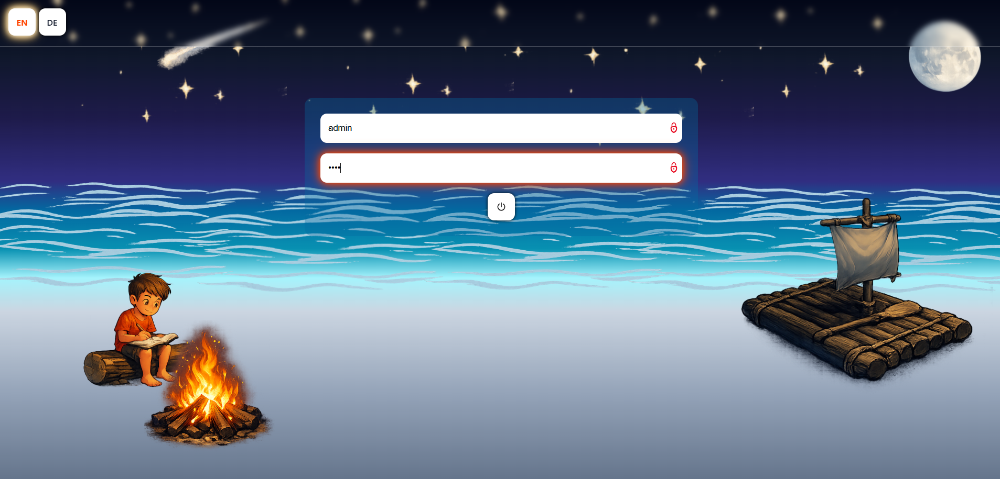
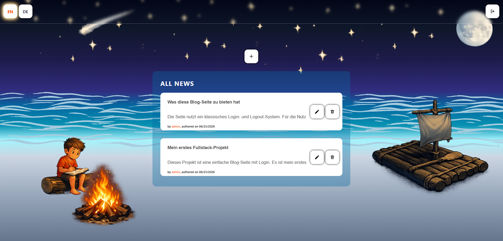
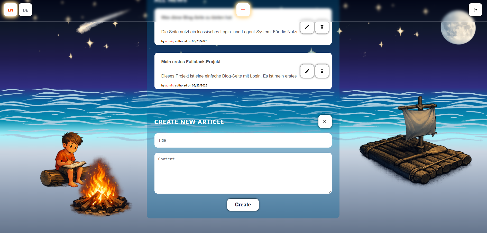
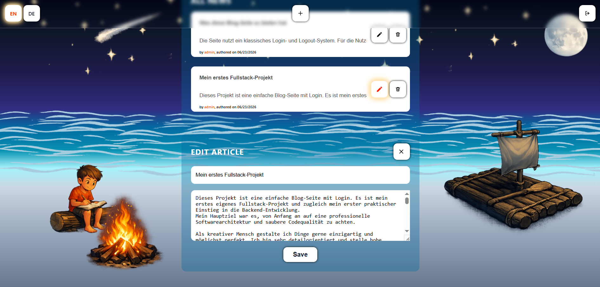
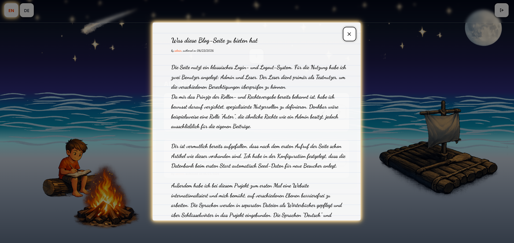
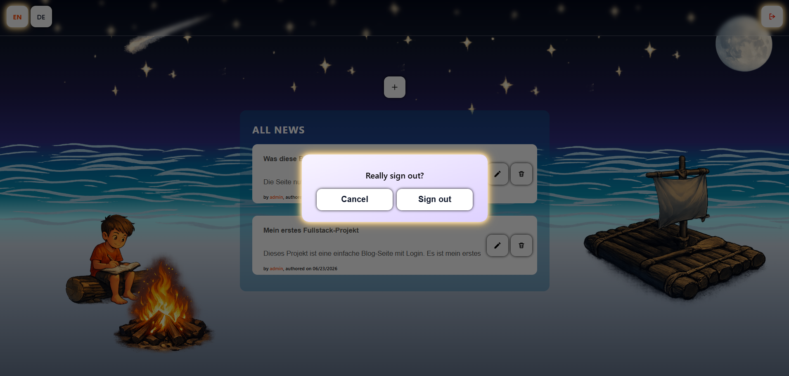

# Blog Website App

🇩🇪 [Deutsch](./README_DE.md) | 🇬🇧 English

My first complete fullstack project. A simple blog website with a login system and CRUD operations for post management. The main focus was to make the project structure and code quality as professional as possible given my current skill level. Built with PHP, SQLite, CSS, and Vanilla JavaScript.

The project includes: a layered architecture with the MVC pattern, object-oriented PHP, internationalization (DE/EN), seed data, a configuration structure, an SQLite database, as well as protection against XSS and SQL injection.

<a id="credentials"></a>

## ◆ Demo Credentials

| User    | Password  | Permission                       |
| ------- | --------- | --------------------------------- |
| `admin` | `Demo26!` | Read, Create, Edit, Delete         |
| `reader`| `Demo26!` | Read                               |

---

## ◆ Getting Started – Running the Project

The project can either be opened directly as a **live demo** or started **locally via Docker**.

### 1 · Live Demo

**[→ Open Demo](https://blog-app-u7lw.onrender.com)**

No installation required — just open the link in your browser.

> **Note:** This project is hosted on Render's free tier. If the app hasn't been visited in a while, it goes to sleep to save resources. The **first request** after a period of inactivity may take **up to ~50 seconds** to respond while the server spins back up — this is expected behavior, not an error. Subsequent requests will be fast.

> **Render** is a cloud hosting service that builds and deploys Docker containers directly from a GitHub repository.

---

### 2 · Run Locally with Docker

#### 2.1 · Install Docker Desktop

> To run the project locally, [Docker Desktop](https://www.docker.com/products/docker-desktop/) must be installed — no further configuration or manual installation is necessary.

| System     | Link |
| ---------- | ---- |
| 🪟 Windows | [Download for Windows](https://docs.docker.com/desktop/setup/install/windows-install/) |
| 🍎 Mac     | [Download for Mac](https://docs.docker.com/desktop/setup/install/mac-install/) |
| 🐧 Linux   | [Download for Linux](https://docs.docker.com/desktop/setup/install/linux/) |

After installation, **start Docker Desktop** and wait until it has fully loaded.

#### 2.2 · Clone the Repository

```bash
git clone https://github.com/gnaldar/blog-app.git
cd blog-app
```

#### 2.3 · Start the App

```bash
docker compose up --build
```

Docker builds the image and starts the server automatically. The first start takes about a minute.

#### 2.4 · Open in Browser

```
http://localhost:8080
```

Log in with the registered [credentials](#credentials) from the table above.

#### 2.5 · Stop the App

Press `Ctrl+C` in the terminal, then:

```bash
docker compose down
```

---

## ◆ Features

### Login & Session Authentication

Users log in with a username and password. Authentication runs via PHP sessions — once logged in, the user remains authenticated across browser restarts until explicit logout.



---

### Home Page & Language Switcher

The home page loads initial posts. These posts are configured seed data that are created once on first runtime.
The language switcher in the top left toggles the entire interface between German and English. The language is automatically detected from the browser settings and stored in the session.



---

### Create Post

Users with the appropriate permission can create new posts via the '+' button. Input is sanitized server-side against XSS and SQL injection before being written to the database.



---

### Edit Post

Existing posts can be edited directly by users with the appropriate permission via the pencil button. As with the '+' button, the creation area adapts to the current state.



---

### Read Post – Article Modal

Clicking on a post opens it in a notebook-style modal window. The modal is loaded without a page reload via the JavaScript API.



---

### Logout

On logout, the session is destroyed server-side and the session cookie is removed from the browser. The logout button is located in the top right of the header.



---

## ◆ Project Structure

```
blog-app/
│
├── .docker/                    # Apache configuration for the container
│   └── vhost.conf              # Virtual host definition (DocumentRoot, PORT)
│
├── config/
│   └── app.config.php          # Central app configuration (paths, settings)
│
├── database/
│   ├── Database.php            # PDO database connection
│   └── seeder/
│       ├── Seed.php            # Seeder class (inserts seed data)
│       └── data.seed.php       # Demo posts and users as seed records
│
├── lang/
│   ├── de.php                  # German translation strings
│   └── en.php                  # English translation strings
│
├── public/                     # Only publicly accessible folder (DocumentRoot)
│   ├── assets/
│   │   ├── icons/              # SVG icons (buttons, favicon)
│   │   ├── images/             # Background images
│   │   └── rdme/               # Screenshots exclusively for this README
│   ├── css/
│   │   └── style.css           # Entire styling of the application
│   ├── js/
│   │   ├── home.js             # Frontend logic (modals, CRUD, language switcher)
│   │   ├── i18n.js             # JavaScript-side translation logic
│   │   └── login.js            # Login form logic
│   └── index.php               # Front controller – the app's single entry point
│
├── src/                        # Entire backend logic
│   ├── constants/
│   │   └── Permission.php      # Bitmask constants for the permission system
│   ├── controller/
│   │   └── UserController.php  # Handles incoming HTTP requests
│   ├── dispatcher/
│   │   └── ControllerDispatcher.php  # Routing – forwards requests to controllers
│   ├── helper/
│   │   └── Lang.php            # i18n helper system (language detection, session, JS injection)
│   ├── repository/
│   │   └── BaseRepo.php        # Database access layer (prepared statements)
│   ├── service/
│   │   ├── LoginService.php    # Authentication logic (login, logout, session)
│   │   └── NewsModifyService.php  # Business logic for CRUD operations on posts
│   └── view/
│       ├── home.php            # HTML template: home page
│       └── login.php           # HTML template: login page
│
├── .dockerignore               # Files not copied into the Docker image
├── .gitignore                  # Files Git does not track
├── docker-compose.yml          # Container configuration (port, volume)
├── docker-entrypoint.sh        # Startup script: sets PORT and Apache configuration
├── Dockerfile                  # Build instructions for the Docker image
├── LICENSE
├── README.md                   # English documentation (this file)
└── README_DE.md                # German documentation
```

---

## ◆ Technologies

Most technologies in this project were **applied for the first time in practice**. Previously, I had only built static websites (HTML, CSS, JavaScript).

**Project focus:** The goal was to understand the interplay of frontend and backend in practice for the first time
and to build a complete fullstack application from scratch — deliberately without frameworks and
libraries, in order to not hide the core behind abstractions.
Deliberately deferred were, among other things, automated tests and continuous version control with Git.
Also implemented for the first time in practice were containerization with Docker and the deployment of a live application.

| Area | Technology | Use |
| --- | --- | --- |
| Backend | PHP 8.2 | Routing, authentication, templating, database access via PDO |
| Database | SQLite | File-based relational database |
| Frontend | CSS | Styling, CSS variables, responsive layout |
| Frontend | Vanilla JavaScript | Frontend logic, API requests, DOM manipulation |
| Server | Apache | Web server (runs inside the Docker container) |
| Infrastructure | Docker | Containerization, local execution, and deployment |
| Hosting | Render | Cloud hosting, automatic deployment from GitHub |

---

## ◆ License

This project is licensed under the [MIT License](./LICENSE).

**Note on assets:** The SVG icons and the background images under `public/assets/images/` were generated with [ChatGPT](https://chatgpt.com) (DALL·E) as individual transparent images. The images were then cropped with [GIMP](https://www.gimp.org) and assembled into a transparent image collage. OpenAI grants users full rights to generated content — these assets are therefore compatible with this project's [MIT license](https://opensource.org/license/mit).