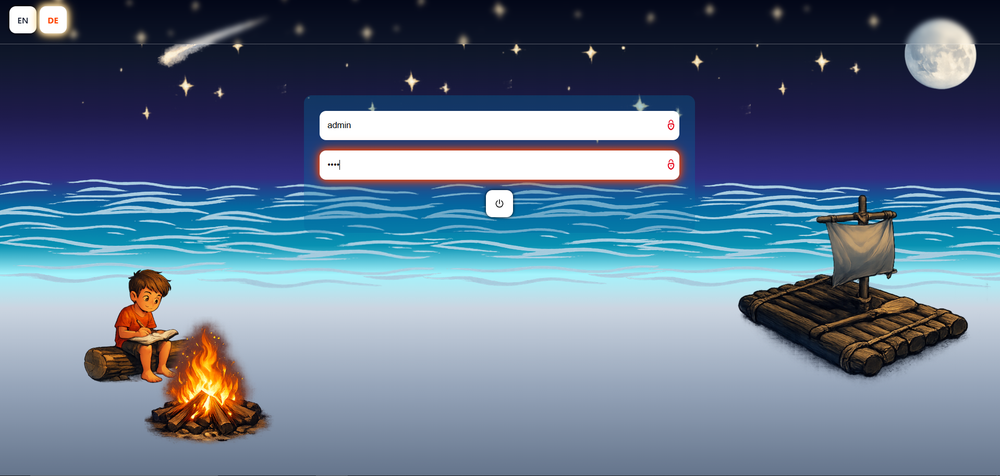
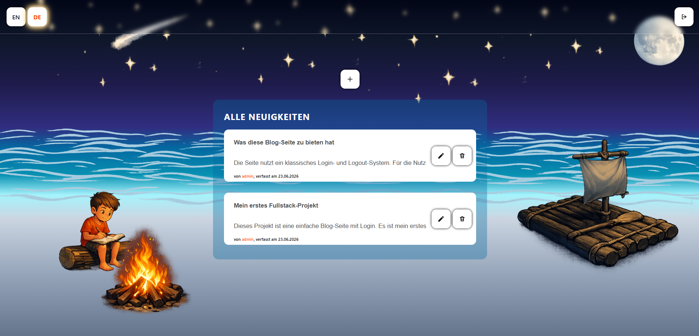
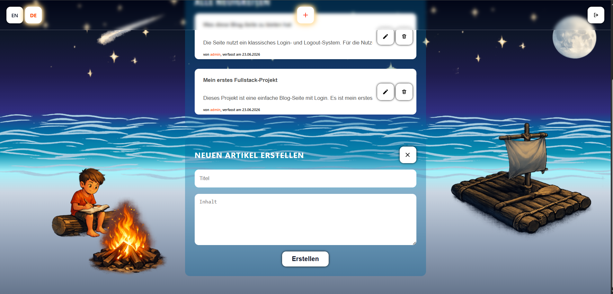
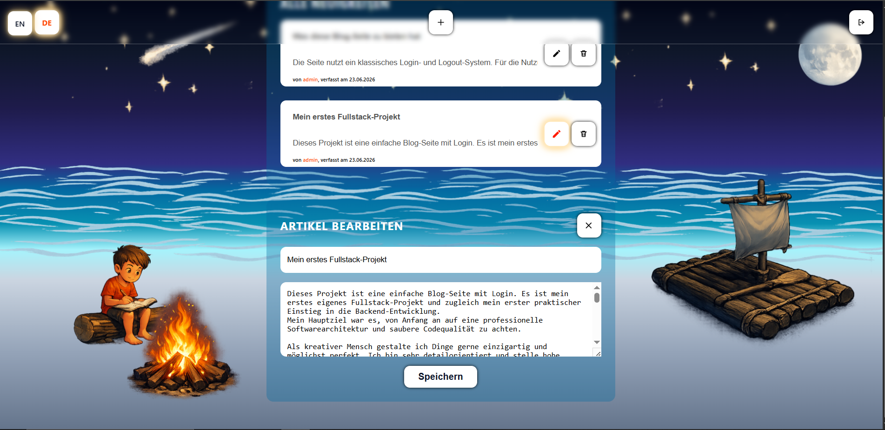
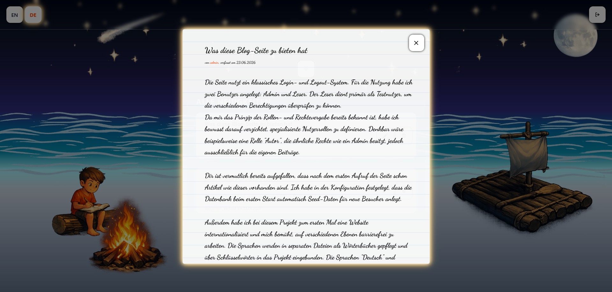
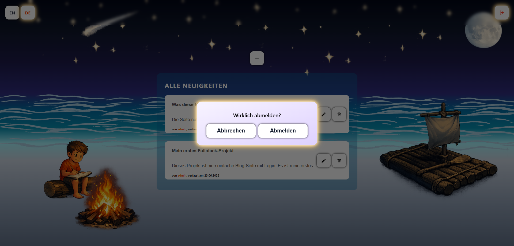

# Blog Website App

🇩🇪 Deutsch | 🇬🇧 [English](./README.md)

Mein erstes vollständiges Fullstack-Projekt. Eine simple Blog-Website mit Login-System und CRUD-Operationen für Beitragsverwaltung. Hauptfokus war es, mit meinem aktuellen Kenntnisstand die Projektstruktur und Codequalität so professionell wie möglich zu gestalten. Erstellt mit PHP, SQLite, CSS und Vanilla JavaScript. 

Das Projekt umfasst: Schichtenarchitektur mit MVC-Pattern, PHP-Objektorientierung, Internationalisierung (DE/EN), Seed-Daten, Konfigurationsstruktur, SQLite-Datenbank, sowie Injektionsschutz gegen XSS und SQL-Injection.

<a id="zugangsdaten"></a>

## ◆ Demo-Zugangsdaten

| Benutzer | Passwort | Berechtigung |
| -------- | -------- | ------------ |
| `admin`  | `Demo26!`| Lesen, Erstellen, Bearbeiten, Löschen |
| `reader` | `Demo26!`| Lesen |

---

## ◆ Erste Schritte – Projekt ausführen

Das Projekt lässt sich entweder direkt als **Live-Demo** öffnen oder **lokal per Docker** starten.

### 1 · Live-Demo

**[→ Demo öffnen](https://blog-app-u7lw.onrender.com)**

Keine Installation nötig — einfach den Link im Browser öffnen.

> **Hinweis:** Dieses Projekt läuft auf dem kostenlosen Render-Free-Tier. Wurde die App länger nicht aufgerufen, geht der Server in einen Ruhezustand, um Ressourcen zu sparen. Der **erste Aufruf** nach einer Inaktivitätsphase kann daher **bis zu ~50 Sekunden** dauern, bis der Server wieder hochgefahren ist — das ist normales Verhalten und kein Fehler. Alle weiteren Aufrufe laufen dann wieder schnell.

> **Render** ist ein Cloud-Hosting-Dienst, der Docker-Container direkt aus einem GitHub-Repository baut und bereitstellt.

---

### 2 · Lokal mit Docker

#### 2.1 · Docker Desktop installieren

> Um das Projekt lokal starten zu können, muss [Docker Desktop](https://www.docker.com/products/docker-desktop/) installiert sein — keine weitere Konfiguration oder manuelle Installation notwendig.

| System     | Link |
| ---------- | ---- |
| 🪟 Windows | [Download für Windows](https://docs.docker.com/desktop/setup/install/windows-install/) |
| 🍎 Mac     | [Download für Mac](https://docs.docker.com/desktop/setup/install/mac-install/) |
| 🐧 Linux   | [Download für Linux](https://docs.docker.com/desktop/setup/install/linux/) |

Nach der Installation **Docker Desktop starten** und warten, bis es vollständig geladen ist.

#### 2.2 · Repository klonen

```bash
git clone https://github.com/gnaldar/blog-app.git
cd blog-app
```

#### 2.3 · App starten

```bash
docker compose up --build
```

Docker baut das Image und startet den Server automatisch. Beim ersten Start dauert das etwa eine Minute.

#### 2.4 · Im Browser öffnen

```
http://localhost:8080
```

Mit den registrierten [Zugangsdaten](#zugangsdaten) aus der Tabelle oben einloggen.

#### 2.5 · App stoppen

`Ctrl+C` im Terminal drücken, dann:

```bash
docker compose down
```

---

## ◆ Features

### Login & Session-Authentifizierung

Benutzer melden sich mit Benutzername und Passwort an. Die Authentifizierung läuft über PHP-Sessions — nach dem Login bleibt man über Browser-Neustarts hinweg angemeldet bis zum expliziten Logout.



---

### Startseite & Sprachumschalter

Die Startseite lädt initiale Beiträge. Diese Beiträge sind konfigurierte Seed-Daten, die einmalig zur ersten Laufzeit erstellt werden.
Über den Sprachumschalter oben links wechselt die gesamte Oberfläche zwischen Deutsch und Englisch. Die Sprache wird automatisch aus den Browser-Einstellungen erkannt und per Session gespeichert.



---

### Beitrag erstellen

Nutzer mit entsprechender Berechtigung können über den '+'-Button neue Beiträge erstellen. Die Eingabe wird serverseitig gegen XSS und SQL-Injection gesichert, bevor sie in die Datenbank geschrieben wird.



---

### Beitrag bearbeiten

Bestehende Beiträge lassen sich von Nutzern mit entsprechender Berechtigung über den Stift-Button direkt bearbeiten. Wie beim '+'-Button wird der Erstellungsbereich nach dem aktuellen Zustand angepasst.



---

### Beitrag lesen – Artikel-Modal

Ein Klick auf einen Beitrag öffnet ihn in einem Modal-Fenster im Notizbuch-Stil. Das Modal wird ohne Seitenneuladen über die JavaScript-API geladen.



---

### Logout

Beim Abmelden wird die Session serverseitig zerstört und der Session-Cookie im Browser gelöscht. Der Abmelden-Button liegt rechts oben im Header.



---

## ◆ Projektverzeichnis

```
blog-app/
│
├── .docker/                    # Apache-Konfiguration für den Container
│   └── vhost.conf              # Virtual-Host-Definition (DocumentRoot, PORT)
│
├── config/
│   └── app.config.php          # Zentrale App-Konfiguration (Pfade, Einstellungen)
│
├── database/
│   ├── Database.php            # PDO-Datenbankverbindung
│   └── seeder/
│       ├── Seed.php            # Seeder-Klasse (führt Seed-Daten ein)
│       └── data.seed.php       # Demo-Beiträge und Benutzer als Seed-Datensätze
│
├── lang/
│   ├── de.php                  # Deutsche Übersetzungsstrings
│   └── en.php                  # Englische Übersetzungsstrings
│
├── public/                     # Einziger öffentlich zugänglicher Ordner (DocumentRoot)
│   ├── assets/
│   │   ├── icons/              # SVG-Icons (Buttons, Favicon)
│   │   ├── images/             # Hintergrundbilder
│   │   └── rdme/               # Screenshots ausschließlich für diese README
│   ├── css/
│   │   └── style.css           # Gesamtes Styling der Anwendung
│   ├── js/
│   │   ├── home.js             # Frontend-Logik (Modals, CRUD, Sprachumschalter)
│   │   ├── i18n.js             # JavaScript-seitige Übersetzungslogik
│   │   └── login.js            # Login-Formular-Logik
│   └── index.php               # Front Controller – einziger Einstiegspunkt der App
│
├── src/                        # Gesamte Backend-Logik
│   ├── constants/
│   │   └── Permission.php      # Bitmask-Konstanten für Berechtigungssystem
│   ├── controller/
│   │   └── UserController.php  # Verarbeitet eingehende HTTP-Requests
│   ├── dispatcher/
│   │   └── ControllerDispatcher.php  # Routing – leitet Requests an Controller weiter
│   ├── helper/
│   │   └── Lang.php            # i18n-Hilfssystem (Spracherkennung, Session, JS-Injection)
│   ├── repository/
│   │   └── BaseRepo.php        # Datenbankzugriffs-Schicht (prepared statements)
│   ├── service/
│   │   ├── LoginService.php    # Authentifizierungslogik (Login, Logout, Session)
│   │   └── NewsModifyService.php  # Geschäftslogik für CRUD-Operationen auf Beiträge
│   └── view/
│       ├── home.php            # HTML-Template: Startseite
│       └── login.php           # HTML-Template: Login-Seite
│
├── .dockerignore               # Dateien, die nicht ins Docker-Image kopiert werden
├── .gitignore                  # Dateien, die Git nicht trackt
├── docker-compose.yml          # Container-Konfiguration (Port, Volume)
├── docker-entrypoint.sh        # Startskript: setzt PORT und Apache-Konfiguration
├── Dockerfile                  # Bauanleitung für das Docker-Image
├── LICENSE
├── README.md                   # Englische Dokumentation
└── README_DE.md                # Deutsche Dokumentation (diese Datei)
```

---

## ◆ Technologien

Die meisten Technologien in diesem Projekt wurden **zum ersten Mal praktisch angewendet**. Zuvor hatte ich ausschließlich statische Webseiten gebaut (HTML, CSS, JavaScript).

**Projektfokus:** Ziel war es, erstmals das Zusammenspiel von Frontend und Backend praktisch zu verstehen 
und eine vollständige Fullstack-Anwendung von Grund auf zu bauen — bewusst ohne Frameworks und 
Bibliotheken, um den Kern nicht hinter Abstraktionen zu verstecken.
Bewusst zurückgestellt wurden u.a. automatisierte Tests und eine stetige Versionsverwaltung mit Git.
Erstmals praktisch umgesetzt wurden außerdem Containerisierung mit Docker und das Deployment einer Live-Anwendung.

| Bereich | Technologie | Einsatz |
| --- | --- | --- |
| Backend | PHP 8.2 | Routing, Authentifizierung, Templating, Datenbankzugriff via PDO |
| Datenbank | SQLite | Dateibasierte relationale Datenbank |
| Frontend | CSS | Styling, CSS-Variablen, responsives Layout |
| Frontend | Vanilla JavaScript | Frontend-Logik, API-Requests, DOM-Manipulation |
| Server | Apache | Webserver (läuft im Docker-Container) |
| Infrastruktur | Docker | Containerisierung, lokales Ausführen und Deployment |
| Hosting | Render | Cloud-Hosting, automatisches Deployment aus GitHub |

---

## ◆ Lizenz

Dieses Projekt steht unter der [MIT-Lizenz](./LICENSE).

**Hinweis zu Assets:** Die SVG-Icons sowie die Hintergrundbilder unter `public/assets/images/` wurden mit [ChatGPT](https://chatgpt.com) (DALL·E) als einzelne transparente Bilder generiert. Die Bilder wurden anschließend mit [GIMP](https://www.gimp.org) zugeschnitten und zu einer transparenten Bildkollage zusammengestellt. OpenAI räumt Nutzern die vollständigen Rechte an generierten Inhalten ein — diese Assets sind daher mit der [MIT-Lizenz](https://opensource.org/license/mit) dieses Projekts kompatibel.